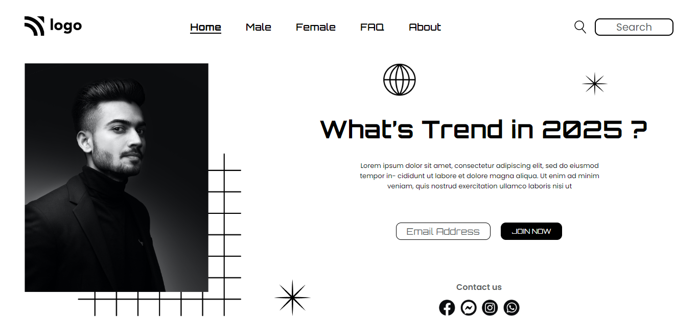

# Street Style Landing Page

***
## Description

This project [Street Style Landing Page]() was built using Semantic HTML and CSS. My main aim while building this project was to learn basics of HTML tags & CSS classes. While building this webpage I faced difficulties in postioning the navlist items & images. The problem was solved using positions & Flexbox and its properties like justify-content, align-items, align-self, etc. The Project was completed under guidance of [Hitesh Choudhary](https://github.com/hiteshchoudhary), CTO Ineuron

***

### Links for Project

* [LIVE Project Link]()

* [Youtube Video Demo]()

* [Source Code]()

***
### Built With 

* Semantic HTML
* Custom CSS classes
* FlexBox
* Positions

***

### Key Learnings

* Learned using [flexbox](https://developer.mozilla.org/en-US/docs/Web/CSS/flex)
* Learned to use [z-index](https://developer.mozilla.org/en-US/docs/Web/CSS/z-index)
* Learned to use [positions](https://developer.mozilla.org/en-US/docs/Web/CSS/position)(absolute & relative)
* Learned to use paddings & margins

***

### Time Taken to finish this project
 

>5 hours

 

***

### Screencapture of Project

 

***
 

### Checkout Portfolio & Other Projects
 

#### [Personal Portfolio]()

#### [Findcoder Profile]()
***

### Connect with Me
* [Mailto](mailto:shubhambhoj3@gmail.com)
* [LinkedIn]()
* [Github]()
* [Findcoder]()
***
***
[go to top](#street-style-landing-page)